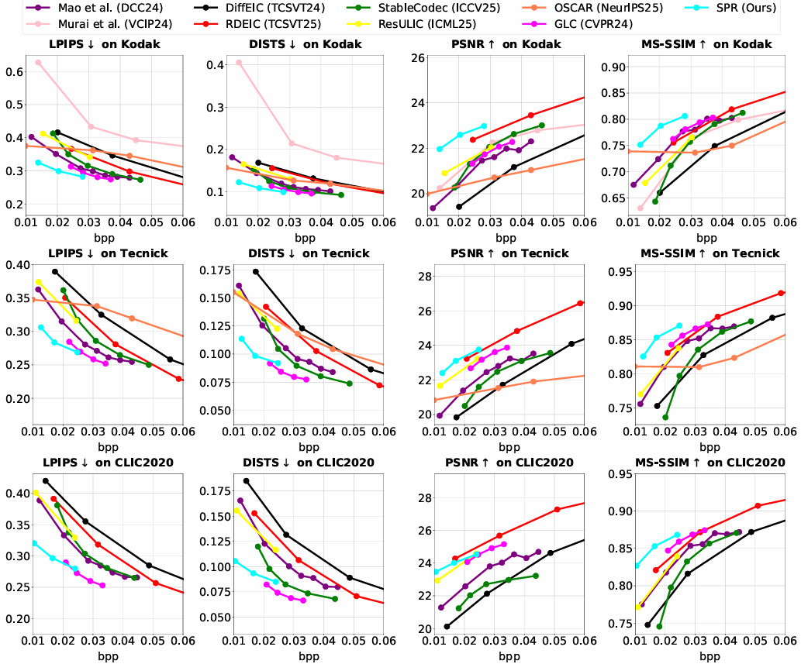
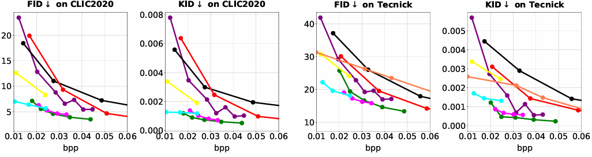
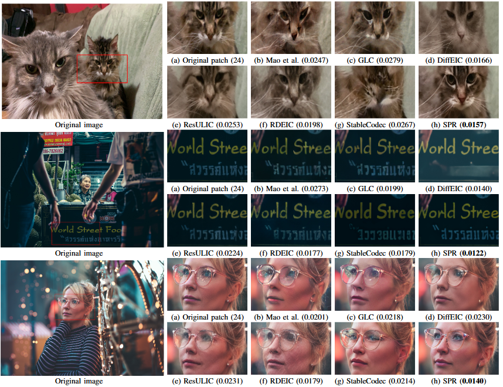

# SPRDiff

## 🔗 Contents

- [x] [Datasets](#Datasets)
- [ ] [Installation](#Installation) 
- [ ] [Models](#Models)
- [ ] [Train and Test](#TrainAndTest)
- [x] [Results](#Results)
- [ ] [Citation](#Citation)
- [ ] [Acknowledgements](#Acknowledgements)

## 📊 Datasets
We train SPRDiff on [LSDIR](https://ofsoundof.github.io/lsdir-data/) + [Flicker2W](https://github.com/liujiaheng/CompressionData) datasets, following [ResULIC](https://github.com/NJUVISION/ResULIC). We then evaluate it on the [Kodak](https://r0k.us/graphics/kodak/), [CLIC_2020](https://clic2025.compression.cc/), and [Tecnick](https://testimages.org) datasets.

##  🔎 Results

&ensp;Quantitative Comparisons (click to expand) 

&ensp;Visual Comparisons (click to expand) 

